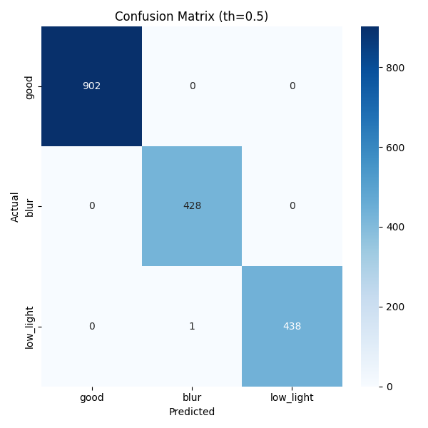

# Vehicle Image Quality Classification

A computer vision pipeline that screens vehicle images for quality issues — **Blur** and **Low Light** — before they reach downstream damage-detection systems. Poor-quality images are automatically flagged and rejected.

---

## How It Works

The system treats image quality screening as a **multi-label classification** problem. Rather than forcing each image into a single category, the model outputs an independent probability for each defect type simultaneously. This means a single image can be flagged for blur, low light, both, or neither — which reflects real-world conditions where a photo can suffer from multiple quality issues at once.

The backbone is a **MobileNetV3-Small** pretrained on ImageNet. Its convolutional feature extractor is frozen and a custom two-output head is attached — one sigmoid output per label (blur, low light). Each output is independent; there is no softmax across them. At inference time, a configurable threshold `τ` is applied to each score separately. If either score exceeds its threshold, the image is marked **Reject**.

```
Input Image (224×224)
       │
       ▼
MobileNetV3-Small (feature extractor)
       │
  AdaptiveAvgPool
       │
  Linear → ReLU → Dropout → Linear(2)
       │
  sigmoid(blur)     sigmoid(low_light)
       │                   │
  blur_score           low_light_score
       │                   │
       └──── OR gate ───────┘
                │
         Accept / Reject
```

---

## Repository Structure

```
Image-Quality-Classification/
├── artifacts/
│   ├── model.pth           # PyTorch model weights
│   └── model.onnx          # Exported ONNX model
├── model.py                # MobileNetV3-Small multi-label model definition
├── train.py                # Training loop (argparse)
├── validate.py             # Validation loop
├── eval.py                 # Evaluation — metrics + confusion matrix
├── inference.py            # Inference script
├── dataset_prep.py         # MultiLabelDataset class
├── transforms.py           # Train / val image transforms
├── metrics.py              # Precision, recall, F1 computation
├── output.json             # Sample inference output
├── output.csv              # Sample inference output
├── requirements.txt        # Python dependencies
└── setup.sh                # Automated environment setup script
```

---

## Setup

### Automated (recommended)

```bash
chmod +x setup.sh
./setup.sh
```

`setup.sh` creates a virtual environment, upgrades pip, and installs all dependencies from `requirements.txt`.

```bash
#!/bin/bash
set -e
echo "[setup] Creating virtual environment..."
python3 -m venv venv
source venv/bin/activate
echo "[setup] Upgrading pip..."
pip install --upgrade pip
echo "[setup] Installing dependencies..."
pip install -r requirements.txt
echo "[setup] Done. Activate with: source venv/bin/activate"
```

### Manual

```bash
python3 -m venv venv
source venv/bin/activate
pip install -r requirements.txt
```

> **GPU Note:** Trained and benchmarked on an **NVIDIA GTX 1650** (4 GB VRAM). CPU inference is supported but slower — see [Performance](#performance).

---

## Training

```bash
python train.py \
  --data_dir /path/to/dataset \
  --epochs 10 \
  --batch_size 32 \
  --lr 1e-4 \
  --save_path artifacts/model.pth
```

The dataset directory should follow this layout:

```
data/
├── blur/
    ├── Train/
        └── good/
        └── blur
    ├── val/
        └── good/
        └── blur
└── low_light/
    ├── Train/
        ├── low_light/
        └── good/
    ├── val/
        ├── low_light/
        └── good/
```

| Parameter | Value |
|---|---|
| Model | MobileNetV3-Small (pretrained ImageNet) |
| Input size | 224 × 224 |
| Batch size | 32 |
| Optimizer | Adam (lr = 1e-4) |
| Loss | BCEWithLogitsLoss |
| Epochs | 10 |

---

## Running Inference

### PyTorch backend

```bash
python inference.py \
  --model artifacts/model.pth \
  --input /path/to/images \
  --backend torch \
  --threshold 0.5 \
  --out_json output.json \
  --out_csv output.csv
```

### ONNX backend

```bash
python inference.py \
  --model artifacts/model.onnx \
  --input /path/to/images \
  --backend onnx \
  --threshold 0.5 \
  --out_json output.json \
```

`--input` accepts either a directory of images or a single image path.

---

## Output Format

### JSON

```json
[
    {
        "image": "1a5083a8-eb380f30_augmented_1_jpg.rf.6a2919aeaeb2a350e498ef996ab9afe3.jpg",
        "predicted_class": "low_light",
        "confidence": 0.9975119829177856,
        "status": "Reject",
        "inference_time_sec": 0.0035274110000500514
    }
]
```

An image is marked `Reject` if `blur_score > th` **or** `low_light_score > th`.

---

## Performance

> Benchmarked on **NVIDIA GTX 1650**, input size 224 × 224.

### Inference Latency

| Device | Avg. time per image |
|---|---|
| GTX 1650 (GPU) | ~9.35 ms |


### Classification Metrics

| Class | Precision | Recall | F1-Score |
|---|---|---|---|
| Blur |.997 |1.0|.998
| Low Light |1.0 |.997  |.998  |
| Good |1.0  |1.0  |1.0  |

### Confusion Matrix



---

## Evaluation

```bash
python eval.py \
  --model artifacts/model.pth \
  --data_dir /path/to/dataset
```

Prints per-class precision, recall, F1, and renders a confusion matrix.
